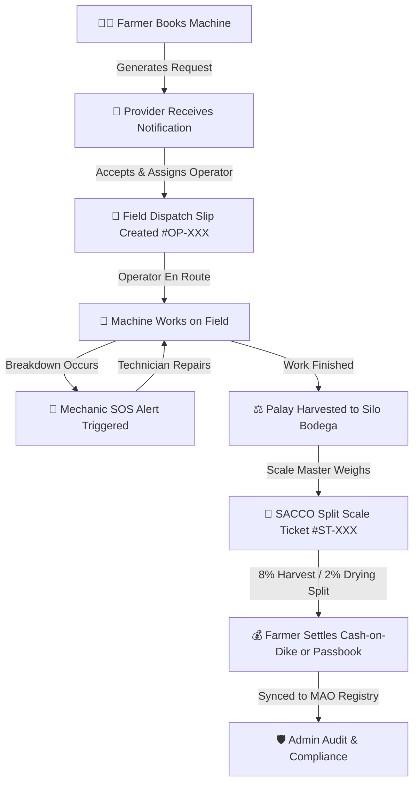

# UMAKONEKTA — UI/UX Design, User Flows & Role Architecture Suggestions

This document presents strategic design improvements, user flow optimizations, and architectural enhancements for the **UMAKONEKTA** Philippine Agricultural Resource Exchange Platform.

---

## 🎨 1. UI/UX Design System & Aesthetic Improvements

### A. Color Palette Refinement & Field Contrast
- **Current State**: Uses `#005426` (Primary Forest Green), `#F4A228` (Field Ochre), and `#F8FAFC` (Light Slate).
- **Suggestions**:
  1. **High-Sun Sunlight Mode (Direct Field Sunlight)**:
     - Farmers and operators work in rice paddies with bright sunlight glare.
     - Implement an ultra-high contrast toggle (`contrast: 1.2`, pure black `#000000` text, bold `700+` weight headers, and pure white cards `#FFFFFF` with `border-2 border-black`).
  2. **Subtle HSL Elevation & Glassmorphism**:
     - Modernize modals and cards with soft ambient drop-shadows (`shadow-[0_12px_40px_rgba(0,84,38,0.06)]`) and frosted glass top-bars (`backdrop-blur-md bg-white/85`).
  3. **Visual Status Badges**:
     - Standardize badge pill aesthetics with pulsing indicator dots for live states (e.g. 🟢 *En Route to Dike*, 🟡 *Awaiting Operator Confirmation*, 🔴 *Urgent Mud Rescue*).

---

### B. Mobile-First & Remote Farm Accessibility
- **Current State**: Responsive layout with Serwist PWA offline support.
- **Suggestions**:
  1. **Bottom Navigation Bar on Mobile Screens (`sm:hidden`)**:
     - Add a sticky bottom bar for mobile farmers with 4 thumb-friendly icons:
       - 🏠 **Home**
       - 🚜 **Marketplace**
       - 📋 **My Tickets**
       - 👤 **Profile / ID**
  2. **Offline Local Storage Queue Indicator**:
     - When a farmer creates a booking or an operator logs hours offline, display a persistent pill: *"3 actions saved offline. Syncing automatically upon reconnecting."*
  3. **Voice Input / Tagalog-Bisaya Audio Prompts**:
     - Web Speech API integration for elderly farmers to dictate notes or parcel landmarks instead of typing.

---

## 🔄 2. End-to-End User Flows & Journeys

### Flow 1: Farmer Machinery Request to Field Dike
1. **Farmer browses Marketplace**: Filters by tractor, combine harvester, or drone within their municipality (e.g., *Tagum City*).
2. **One-Tap Quick Booking**: Selects parcel sector, hectares, and schedule date. Automatic diesel calculator estimates fuel needs.
3. **Provider Depot Acceptance**: Co-op dispatcher assigns Ka Nestor andYan-mar tractor.
4. **Physical Dispatch Ticket**: Operator brings printable A4 slip with barcode verification.

---

### Flow 2: Emergency Field Breakdown & Mud Rescue (SOS Flow)
1. **Operator / Farmer encounters stall**: Tiller belt snaps or tractor sinks into lowland clay.
2. **Press "🚨 Emergency SOS" Button**: Captures GPS coordinates and equipment serial number.
3. **Mechanic Mobile Van Alerted**: Nearest technician receives push dispatch with turn-by-turn dike route.
4. **On-Field Fix & Certification**: Mechanic logs spare parts used and records official DA repair certificate.

---

### Flow 3: Grain Harvest & SACCO Split Scale Settlement
1. **Combine Harvester loads bags**: Palay transported to municipal silo bodega.
2. **Weighbridge gross & tare calculation**: Scale ticket captures moisture content (MC).
3. **Automated Split Formula**:
   - `Gross Value = Clean Net Kg * Base Price`
   - `- 8% Harvester Share`
   - `- 2% Silo Drying & Handling Fee`
   - `= Net Farmer Payout`
4. **Immediate Settlement**: Credited to cooperative passbook or disbursed as cash.

---

## 👥 3. Comprehensive User Roles Matrix & Suggested Features

| Role | Core Purpose | Existing Features | Suggested Next-Phase Features |
| :--- | :--- | :--- | :--- |
| **🧑‍🌾 Farmer** | Request machinery, view parcel ledger, verify RSBSA ID. | - Quick Machinery Request Modal - Diesel Fuel Calculator - RSBSA Badge | - **SMS Dispatch Status Updates** (*"Tractor arriving in 20 mins"*). - **Crop Weather & Typhoon Rain Radar Widget**. - **Voice Note Landmark Directions**. |
| **🚜 Machinery Provider / SACCO** | Manage depot fleet, accept farmer jobs, issue dispatch tickets. | - `+ Post Machinery` Modal - Live Farmer Needs Feed - Fleet Management | - **Fuel Requisition Ledger**. - **Operator Shift & Hectare Performance Leaderboard**. - **Automated Passbook Billing Ledger**. |
| **🔧 Field Mechanic** | Emergency mobile repair, van parts inventory, repair certification. | - Emergency SOS Feed - Spare Parts Stock Tracker - Repair Logs Modal | - **Offline Diagnostic Trouble Code (DTC) Guide**. - **Spare Parts QR Scanner**. - **Mobile Van GPS Route Optimizer**. |
| **🛡️ Municipal Admin / MAO** | Accredit machinery, issue farmer IDs, audit dispatch settlements. | - Farmer ID Creator (Barcode Front + Back Contacts) - Fleet Certification - Audit Ledger | - **Barangay Cluster Heatmaps** (*Most utilized tractors / harvest yield*). - **Disaster Relief Proxy Filing**. - **DA Regional Subsidy Allocation Tracker**. |

---

## 💡 4. High-Impact Action Items for Next Development Sprints

1. **Agri-Weather & Typhoon Alert Banner**:
   - Integrate PAGASA API / OpenWeatherMap to warn farmers and operators when heavy rain or flood risks threaten harvesting.
2. **SMS Notification Webhook (Twilio / PhilSMS)**:
   - Automated SMS confirmation for farmers without continuous 4G mobile internet.
3. **QR / Barcode Optical Scanner Utility**:
   - Web camera scanner allowing gatekeepers at municipal depots to scan farmer ID cards instantly.
4. **Multi-Parcel Farm Portfolio**:
   - Enable farmers with multiple non-contiguous parcels (e.g. Parcel A: 1.2 ha rice, Parcel B: 2.5 ha corn) to manage bookings separately.
