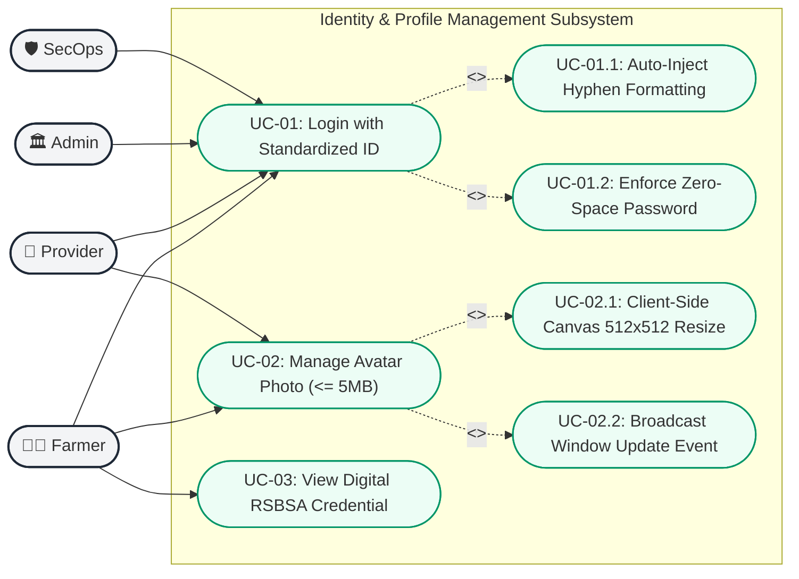
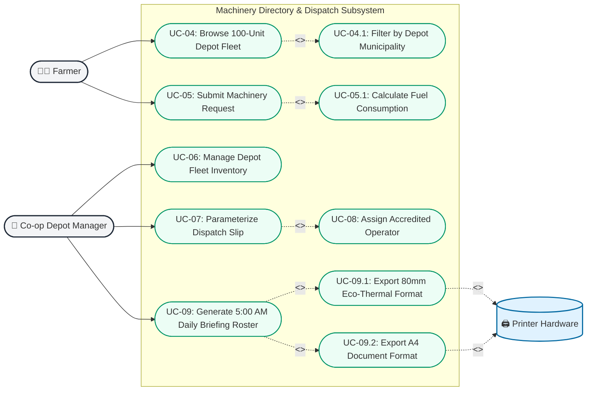
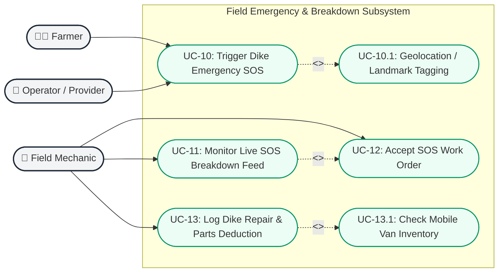
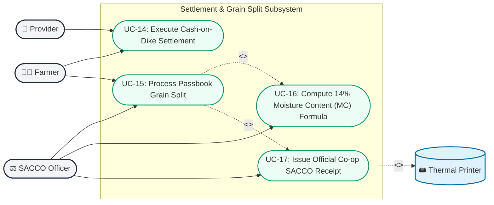
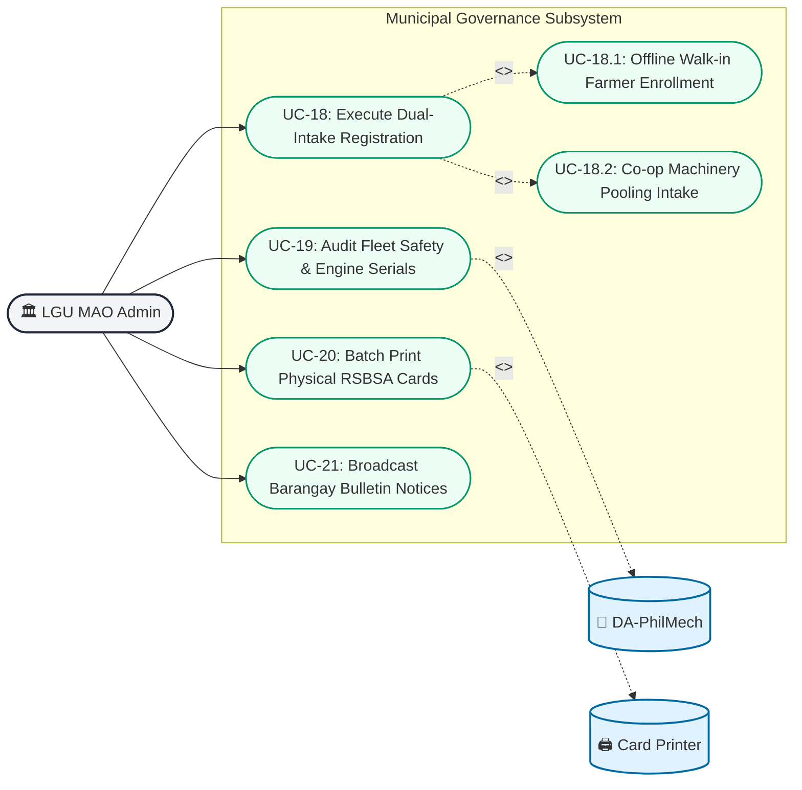
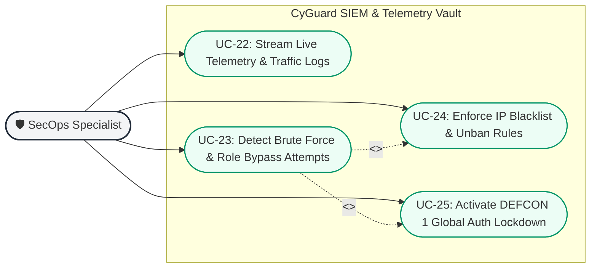

# UML Use Case Diagram Specification — UMAKONEKTA
**Philippine Agrarian Resource Directory & Exchange Platform**

---

## 1. System Boundary & Executive Overview

**UmaKonekta** is an offline-first agrarian exchange platform engineered for rural Philippine agricultural ecosystems (specifically modeled after agrarian reform corridors in Davao del Norte). The platform coordinates machinery sharing, accredited driver allocation, mobile field dike repairs, cash-on-dike and grain-split settlements, municipal LGU compliance, and autonomous SecOps threat defense.

```mermaid
flowchart TB
    subgraph SYSTEM_BOUNDARY ["System Boundary: UMAKONEKTA Platform"]
        subgraph MOD_AUTH ["1. Identity & Profile Subsystem"]
            UC_AUTH1(["UC-01: Authenticate with Role-Based ID"]):::uc
            UC_AUTH2(["UC-02: Manage Digital RSBSA Profile & Avatar"]):::uc
            UC_AUTH3(["UC-03: Validate Institutional Registry ID"]):::uc
        end

        subgraph MOD_FLEET ["2. Fleet, Booking & Dispatch Subsystem"]
            UC_FLT1(["UC-04: Browse Regional Depot Fleet"]):::uc
            UC_FLT2(["UC-05: Request Farm Machinery"]):::uc
            UC_FLT3(["UC-06: Assign Accredited Driver/Operator"]):::uc
            UC_FLT4(["UC-07: Approve/Parameterize Dispatch Slip"]):::uc
            UC_FLT5(["UC-08: Generate Daily Dispatch Briefing Roster"]):::uc
        end

        subgraph MOD_FIELD ["3. Field Emergency & Maintenance Subsystem"]
            UC_FLD1(["UC-09: Broadcast Emergency Dike SOS"]):::uc
            UC_FLD2(["UC-10: Accept SOS & Dispatch Repair Unit"]):::uc
            UC_FLD3(["UC-11: Log Field Repair & Deduct Spare Parts"]):::uc
        end

        subgraph MOD_FIN ["4. Financial Settlement & SACCO Ledger"]
            UC_FIN1(["UC-12: Settle via Cash-on-Dike"]):::uc
            UC_FIN2(["UC-13: Process SACCO Passbook Harvest Grain Split"]):::uc
            UC_FIN3(["UC-14: Calculate 14% Moisture Content & Print Receipt"]):::uc
        end

        subgraph MOD_GOV ["5. Municipal Governance & Compliance"]
            UC_GOV1(["UC-15: Dual-Intake Farmer/Machinery Registration"]):::uc
            UC_GOV2(["UC-16: Audit Engine Serials & PhilMech Clearances"]):::uc
            UC_GOV3(["UC-17: Batch-Generate Physical RSBSA Cards"]):::uc
            UC_GOV4(["UC-18: Broadcast Barangay Bulletin Notices"]):::uc
        end

        subgraph MOD_SEC ["6. SecOps Telemetry & Threat Defense"]
            UC_SEC1(["UC-19: Monitor SIEM Security Telemetry"]):::uc
            UC_SEC2(["UC-20: Manage IP Firewall Blacklist"]):::uc
            UC_SEC3(["UC-21: Trigger DEFCON 1 Global Lockdown"]):::uc
        end
    end

    %% Human Actors
    Farmer["🧑‍🌾 Farmer<br/>(RSBSA Beneficiary)"]:::actor
    Provider["🚜 Co-op Depot Manager<br/>(Fleet Provider)"]:::actor
    Mechanic["🔧 Field Mechanic<br/>(Mobile Repair Unit)"]:::actor
    Sacco["⚖️ SACCO Officer<br/>(Credit & Silo Weigher)"]:::actor
    Admin["🏛️ Municipal Admin<br/>(LGU MAO / MARPO)"]:::actor
    SecOps["🛡️ SecOps Specialist<br/>(Telemetry Operator)"]:::actor

    %% External Systems
    PhilMech[("🏢 DA-PhilMech / RSBSA API")]:::system
    Printer[("🖨️ Thermal / A4 Field Printer")]:::system
    PWAStorage[("💾 Offline Service Worker Storage")]:::system

    %% Actor Connections
    Farmer --> UC_AUTH1
    Farmer --> UC_AUTH2
    Farmer --> UC_FLT1
    Farmer --> UC_FLT2
    Farmer --> UC_FLD1
    Farmer --> UC_FIN1

    Provider --> UC_AUTH1
    Provider --> UC_FLT3
    Provider --> UC_FLT4
    Provider --> UC_FLT5
    Provider --> UC_FIN1

    Mechanic --> UC_AUTH1
    Mechanic --> UC_FLD2
    Mechanic --> UC_FLD3

    Sacco --> UC_AUTH1
    Sacco --> UC_FIN2
    Sacco --> UC_FIN3

    Admin --> UC_AUTH1
    Admin --> UC_GOV1
    Admin --> UC_GOV2
    Admin --> UC_GOV3
    Admin --> UC_GOV4

    SecOps --> UC_AUTH1
    SecOps --> UC_SEC1
    SecOps --> UC_SEC2
    SecOps --> UC_SEC3

    %% System Relationships
    UC_AUTH3 -.->|"<<verify>>"| PhilMech
    UC_FLT5 -.->|"<<output>>"| Printer
    UC_FIN3 -.->|"<<output>>"| Printer
    UC_GOV3 -.->|"<<output>>"| Printer
    UC_FLT1 -.->|"<<cache>>"| PWAStorage
    UC_FLD1 -.->|"<<offline queue>>"| PWAStorage

    %% Includes & Extends
    UC_FLT2 -.->|"<<include>>"| UC_AUTH3
    UC_FLT4 -.->|"<<include>>"| UC_FLT3
    UC_FIN2 -.->|"<<include>>"| UC_FIN3
    UC_FLD1 -.->|"<<extend>>"| UC_FLD2

    classDef actor fill:#f3f4f6,stroke:#1f2937,stroke-width:2px,font-weight:bold;
    classDef system fill:#e0f2fe,stroke:#0369a1,stroke-width:2px,font-weight:bold;
    classDef uc fill:#ecfdf5,stroke:#059669,stroke-width:1.5px,font-size:12px;
```



---

## 2. Actor Catalog & Classification

### 2.1 Primary Actors (Human)

| Actor | Standardized Identifier | Operational Context | Primary Responsibilities |
| :--- | :--- | :--- | :--- |
| **Smallholder Farmer** | `farmer-MM-DD-A000`<br>*(e.g., `farmer-1-23-A001`)* | Field dike, lowland rice paddies, upland farm parcels with intermittent 3G/4G connectivity. | • Browse regional fleet of 100 machines.<br>• Submit machinery requests with diesel estimations.<br>• Track booking statuses & digital RSBSA credentials.<br>• Broadcast emergency breakdown SOS alerts. |
| **Machinery Provider / Depot Manager** | `provider-MM-DD-A000`<br>*(e.g., `provider-1-23-A001` to `A010`)* | Agricultural Cooperative (FCA/SACCO) and private fleet depots across 10 municipal hubs. | • Manage 10 assigned municipal fleet units.<br>• Review community machinery needs.<br>• Map accredited drivers to approved requests.<br>• Print Daily Dispatch Briefing Rosters (5:00 AM). |
| **Field Mechanic** | `mechanic-MM-DD-A000`<br>*(e.g., `mechanic-1-23-A001`)* | Mobile repair vans with satellite GPS navigating rural farm access dikes. | • Monitor real-time Emergency SOS feed.<br>• Accept breakdown dispatches with landmark routing.<br>• Log work orders and deduct spare parts from van inventory. |
| **SACCO / Financial Officer** | `sacco-MM-DD-A000` / Staff Role | Co-op credit counters and grain silo scale weighing stations. | • Manage cooperative passbook deductions.<br>• Calculate 8-10% harvest grain splits (Palay).<br>• Factor in 14.0% moisture discount formulas and drying fees. |
| **Municipal Admin (LGU MAO)** | `admin-MM-DD-A000`<br>*(e.g., `admin-1-23-A001`)* | Municipal Agriculture Office command center and agrarian reform personnel. | • Oversee dual-intake registration (offline farmers & fleet).<br>• Audit engine serials & DA-PhilMech safety clearances.<br>• Batch generate and print physical plastic RSBSA ID cards. |
| **SecOps Specialist** | `secops-MM-DD-A000`<br>*(Alias: `SECOPS-ALPHA-01`)* | Security operations vault (`/x9f-telemetry-vault-8812`). | • Monitor real-time SIEM security telemetry.<br>• Enforce IP blacklist firewall rules.<br>• Execute DEFCON 1 system-wide authentication lockdown. |

### 2.2 Secondary & Supporting Actors (Systems & Hardware)

| External Actor | Type | Interaction Details |
| :--- | :--- | :--- |
| **DA-PhilMech / RSBSA Registry** | External Government System | Validates Registry System for Basic Sectors in Agriculture (RSBSA) identification and equipment safety records. |
| **Offline Service Worker / Cache** | Browser Storage / Client Subsystem | Enables low-connectivity offline dispatch caching, background sync, and offline RSBSA ID presentation. |
| **SecOps Telemetry Fallback Logger** | Filesystem Subsystem | Captures raw security event data into `siem-fallback.log` directly on the edge node if primary SQLite/Prisma insertions fail. |
| **Universal ErrorMessage System** | UI Subsystem | Standardized error boundary and notification architecture replacing localized alerts for consistent user feedback. |
| **Field Thermal & A4 Hardware** | Hardware Peripheral | Prints 80mm ESC/POS thermal receipts and standard A4 dispatch slips/rosters directly on-site. |

---

## 3. Subsystem Detailed Use Case Diagrams

### 3.1 Subsystem 1: Identity, Authentication & Profile Management



---

### 3.2 Subsystem 2: Machinery Directory, Fleet Booking & Dispatch



---

### 3.3 Subsystem 3: Field Emergency & Dike Mechanics



---

### 3.4 Subsystem 4: Agrarian Settlement & SACCO Grain Split



---

### 3.5 Subsystem 5: Municipal Governance & LGU Oversight



---

### 3.6 Subsystem 6: Security Operations & SIEM Telemetry



---

## 4. Comprehensive Use Case Specifications

### Use Case UC-05: Request Farm Machinery
* **Primary Actor:** Smallholder Farmer (`farmer-1-23-A001`)
* **Supporting Systems:** PWA Offline Cache, DA-LGU Machinery Registry
* **Pre-conditions:**
  1. Farmer is authenticated with an active RSBSA status.
  2. Selected machine is listed as `"available"` in the municipal depot.
* **Trigger:** Farmer clicks **"Request Machinery"** from `/farmer-dashboard` or `/marketplace`.
* **Main Success Scenario:**
  1. System opens `<SmartSearchSelect />` modal populated with the 100-unit depot fleet.
  2. Farmer selects target machinery (e.g., *Kubota L5018 4WD Tractor - Carmen Depot*).
  3. Farmer inputs farm parcel area in hectares (e.g., `2.5 ha`) and desired scheduling date.
  4. System automatically calculates estimated fuel consumption (diesel liters) and rental pricing.
  5. Farmer selects settlement method (*Cash-on-Dike* or *SACCO Passbook Grain Split*).
  6. Farmer confirms request; system creates `DispatchRequest` in status `"pending"`.
  7. Notification is routed to the designated Depot Manager dashboard.
* **Alternative Flows:**
  * **3a. Intermittent/Offline Connectivity:** If device is offline, Service Worker stores the request payload in IndexedDB and queues background sync upon reconnection.
* **Post-conditions:** Request appears in Farmer's active booking card feed and Depot Manager's incoming queue.

---

### Use Case UC-07: Parameterize Dispatch Slip & Assign Driver
* **Primary Actor:** Machinery Provider / Depot Manager (`provider-1-23-A001`)
* **Supporting Systems:** Thermal / A4 Print Engine
* **Pre-conditions:** Incoming `DispatchRequest` with status `"pending"`.
* **Trigger:** Depot Manager clicks **"Review & Approve"** on a pending farmer request.
* **Main Success Scenario:**
  1. Depot Manager reviews farm parcel location, scheduled date, and required implements.
  2. Depot Manager assigns an accredited institutional operator (e.g., *Cert #819 - Eduardo Santos*).
  3. System updates asset status to `"dispatched"`.
  4. System generates official Dispatch Slip containing QR code, verification seal, fuel quota, and payment terms.
  5. System creates an entry in the **5:00 AM Daily Dispatch Briefing Roster**.
* **Post-conditions:** `DispatchRequest` transitions to `"approved"`; Dispatch Slip is ready for print/download.

---

### Use Case UC-10: Trigger Dike Emergency SOS
* **Primary Actor:** Smallholder Farmer or Field Machinery Operator
* **Supporting Systems:** Mobile GPS / Geolocation Sensor, Field SMS/PWA Alert Relay
* **Pre-conditions:** User is logged in; machinery experiences breakdown (e.g., clogged fuel injector, thrown track belt, mud bogging).
* **Trigger:** User taps the high-contrast **"Emergency SOS"** button.
* **Main Success Scenario:**
  1. System displays quick triage checklist (Engine Failure, Stuck Chassis, Belt Rupture, Hydraulic Leak).
  2. System captures GPS coordinates or prompts for the nearest barangay irrigation canal landmark.
  3. User submits SOS alert.
  4. System immediately broadcasts ticket to the `/mechanic-dashboard` Live SOS Breakdown Feed with audible and visual indicators.
* **Post-conditions:** Emergency ticket is logged in real-time; mechanic repair units can claim the work order.

---

### Use Case UC-15: Process SACCO Passbook Harvest Grain Split
* **Primary Actor:** SACCO Financial Officer / Silo Weigher
* **Supporting Systems:** Silo Moisture Meter, Receipt Thermal Printer
* **Pre-conditions:** Combine harvester operation completed; fresh unhusked paddy (*palay*) harvested.
* **Trigger:** Farmer and Operator present gross grain sacks at cooperative weighbridge.
* **Main Success Scenario:**
  1. SACCO Officer opens `/sacco-receipt` and enters farmer RSBSA ID.
  2. Officer inputs gross grain weight (kg) and measured moisture content (e.g., `22.5% MC`).
  3. System executes standardized DA moisture deduction formula down to standard base `14.0% MC`.
  4. System computes harvest grain share (standard 8.0% to 10.0% machine share).
  5. System records rental payment credit to Co-op Fleet and returns net palay balance to farmer passbook.
  6. Officer triggers ESC/POS thermal print of the official Co-op Grain Settlement Receipt.
* **Post-conditions:** Palay balance credited, machinery rental marked settled, printable receipt generated.

---

### Use Case UC-25: Activate DEFCON 1 Global Auth Lockdown
* **Primary Actor:** SecOps Specialist (`secops-1-23-A001`)
* **Supporting Systems:** CyGuard SIEM Telemetry Vault, Edge Middleware
* **Pre-conditions:** Active distributed brute-force or unauthorized credential stuffing detected.
* **Trigger:** SecOps Specialist engages the **DEFCON 1 Lockdown** toggle.
* **Main Success Scenario:**
  1. System requests secondary biometric/security PIN confirmation.
  2. SecOps Specialist confirms emergency protocol.
  3. Middleware instantly revokes all public session cookies and suspends non-admin login endpoints.
  4. Public pages show an offline maintenance security advisory banner.
  5. All malicious telemetry IPs are written to `IpBlacklist` table.
* **Post-conditions:** System enters read-only emergency lockdown; only authenticated SecOps tokens retain portal access.

---

## 5. Traceability Matrix: Use Cases to System Routes & Models

| Use Case ID | Use Case Name | Primary Route | Backend API / Service | Prisma Model(s) |
| :--- | :--- | :--- | :--- | :--- |
| **UC-01** | Role-Based Authentication | `/login` | `src/lib/auth.js` | `User`, `SiemLog` |
| **UC-02** | Manage Avatar Photo | `/farmer-dashboard` | Client Canvas API | `User` |
| **UC-03** | Digital RSBSA Credential | `/farmer-dashboard` | Offline Local Storage | `User` |
| **UC-04** | Browse Regional Fleet | `/marketplace` | `/api/assets` | `Asset` |
| **UC-05** | Request Farm Machinery | `/farmer-dashboard` | `/api/requests` | `DispatchRequest`, `Asset` |
| **UC-06** | Manage Fleet Inventory | `/provider-dashboard` | `/api/assets` | `Asset` |
| **UC-07** | Parameterize Dispatch Slip | `/dispatch-slip` | `/api/requests` | `DispatchRequest`, `Asset` |
| **UC-08** | Assign Operator | `/provider-dashboard` | `/api/requests` | `DispatchRequest`, `User` |
| **UC-09** | Daily Dispatch Roster | `/daily-roster` | Client Print Generator | `DispatchRequest`, `Asset` |
| **UC-10** | Dike Emergency SOS | `/farmer-dashboard` | `/api/emergency` | `DispatchRequest`, `User` |
| **UC-11** | Live SOS Breakdown Feed | `/mechanic-dashboard` | `/api/emergency/feed` | `DispatchRequest`, `Asset` |
| **UC-12** | Accept SOS Work Order | `/mechanic-dashboard` | `/api/emergency/claim`| `DispatchRequest` |
| **UC-13** | Log Field Repair & Parts | `/mechanic-dashboard` | `/api/inventory` | `Asset` |
| **UC-14** | Cash-on-Dike Settlement | `/dispatch-slip` | `/api/settlement` | `DispatchRequest` |
| **UC-15** | SACCO Grain Split | `/sacco-receipt` | `/api/sacco/split` | `DispatchRequest`, `User` |
| **UC-16** | 14% MC Moisture Calc | `/sacco-receipt` | `src/lib/agriMath.js` | N/A (Algorithmic) |
| **UC-17** | Print Co-op Receipt | `/sacco-receipt` | Browser Print API | N/A (Hardware) |
| **UC-18** | Dual-Intake Registration | `/admin` | `/api/admin/register` | `User`, `Asset` |
| **UC-19** | Audit Fleet Certifications | `/admin` | `/api/admin/audit` | `Asset` |
| **UC-20** | Batch Print RSBSA Cards | `/admin` | Client SVG/PDF Engine | `User` |
| **UC-21** | Barangay Bulletin Notices | `/bulletin-notice` | `/api/bulletin` | `SystemConfig` |
| **UC-22** | Stream SIEM Telemetry | `/x9f-telemetry-vault-8812` | `/api/telemetry` | `SiemLog`, `TrafficLog` |
| **UC-23** | Detect Brute Force | `/x9f-telemetry-vault-8812` | `src/middleware.js` | `SiemLog` |
| **UC-24** | Manage IP Blacklist | `/x9f-telemetry-vault-8812` | `/api/secops/ip` | `IpBlacklist` |
| **UC-25** | DEFCON 1 Lockdown | `/x9f-telemetry-vault-8812` | `/api/secops/lockdown`| `SystemConfig` |

---

## 6. How to View, Export & Import the Diagrams

### Option A: Paste into Mermaid Live Editor (Free Online)
1. Go to [https://mermaid.live](https://mermaid.live).
2. Copy any diagram block from this file (copy everything starting from `flowchart TB` or `flowchart LR` down to the last `classDef`, excluding the triple backticks ```).
3. Paste into the left **Code** panel.
4. The diagram renders in real-time in the preview pane.
5. Click **Actions** (bottom left) -> choose **PNG**, **SVG**, or **Copy Markdown** for instant high-resolution exports for your thesis or reports.

---

### Option B: Import directly into draw.io (diagrams.net)
1. Open [https://app.diagrams.net](https://app.diagrams.net) (or your desktop draw.io app).
2. In the top menu bar, click:
   `Arrange` ➔ `Insert` ➔ `Advanced` ➔ `Mermaid...`  
   *(Alternative: Click the `+` (Plus) button in the top toolbar ➔ `Advanced` ➔ `Mermaid...`)*
3. Paste the Mermaid code snippet into the text dialog (excluding markdown triple backticks).
4. Click the blue **Insert** button.
5. draw.io will automatically convert every actor, use case oval, boundary box, and connection line into **fully editable native draw.io vector shapes**!
6. You can rearrange boxes, change colors, or replace actor boxes with draw.io's native UML Actor icons as needed.

---

### Option C: In-IDE Preview (VS Code / Cursor / Windsurf)
* Open this file in your editor and press `Ctrl + Shift + V` (Windows) to open the Markdown Preview. All diagrams will render natively.
